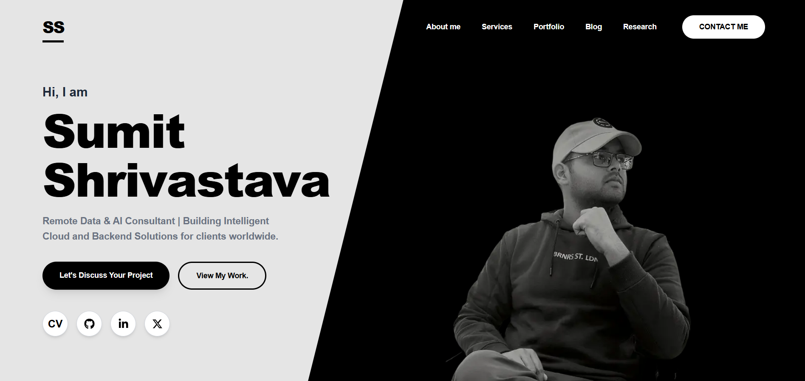

# Sumit Shrivastava — Portfolio & Consulting Platform (V2)

A fast, minimalist personal portfolio and technical consulting website. Built from the ground up using **Next.js 15 (App Router)**, **TypeScript**, and **Tailwind CSS**, and deployed globally on **Vercel**.

🌐 **Live URL:** [sumitshrivastava.me](https://sumitshrivastava.me)

---

## ⚡ Overview

This repository houses the second iteration (V2) of my portfolio. The focus of this rebuild was eliminating unnecessary client-side bloat, modernizing the visual language with a restrained black-and-white aesthetic, and achieving near-perfect Core Web Vitals across mobile and desktop.

### Highlights
* **Performance-First:** Achieves 95+ Performance and 100 SEO scores on mobile Google Lighthouse audits.
* **Modern App Router:** Uses React Server Components by default to serve zero unnecessary client-side JavaScript.
* **Dynamic Search Optimization:** Programmatic `sitemap.ts` and `robots.ts` generation aligned with Google Search Console.
* **Accessible UI:** Semantic HTML hierarchy, ARIA-labeled navigation controls, and high-contrast typography.
* **External Writing Engine:** Curated feed pointing directly to deep-dive technical publications on Medium and Dev.to.

---

## 🛠️ Tech Stack

* **Framework:** [Next.js 15](https://nextjs.org/) (App Router)
* **Language:** [TypeScript](https://www.typescriptlang.org/)
* **Styling:** [Tailwind CSS](https://tailwindcss.com/)
* **Icons:** [React Icons](https://react-icons.github.io/react-icons/)
* **Contact Integration:** [Web3Forms API](https://web3forms.com/)
* **Hosting & CDN:** [Vercel](https://vercel.com/)
* **DNS & Domain Management:** Namecheap

---

## 📂 Project Architecture

```text
├── app/
│   ├── blog/              # Curated technical writing & publications
│   ├── education/         # Academic background & credentials
│   ├── experience/        # Professional experience timeline
│   ├── portfolio/         # Featured client work & production projects
│   ├── services/          # Detailed consulting service offerings
│   ├── globals.css        # Global CSS & base styles
│   ├── layout.tsx         # Root layout & global metadata
│   ├── page.tsx           # Primary landing page
│   ├── robots.ts          # Dynamic robots.txt generation
│   └── sitemap.ts         # Automated XML sitemap generation
├── components/            # Reusable modular UI components
│   ├── About.tsx
│   ├── Contact.tsx
│   ├── Footer.tsx
│   ├── Hero.tsx
│   ├── Services.tsx
│   ├── SubpageNav.tsx
│   └── TechStack.tsx
├── public/                # Static assets & profile imagery
├── tailwind.config.ts     # Tailwind design tokens & plugin setup
└── next.config.ts         # Next.js build & runtime configuration

```
### 🚀 Getting Started

To run this project locally on your machine:

1. **Clone the repository**
   ```bash
   git clone [https://github.com/sumitshrivastava-tech/My-Portfolio-Website-V2.git](https://github.com/sumitshrivastava-tech/My-Portfolio-Website-V2.git)
   cd My-Portfolio-Website-V2

2. **Install dependencies**
```bash
npm install

```
3. **Configure environment variables**
Create a .env.local file in the root directory:
```bash
NEXT_PUBLIC_WEB3FORMS_KEY=your_web3forms_access_key_here

```
4. **Start the development server**
```bash
npm run dev
```
Open http://localhost:3000 in your browser to view the application.

### 📦 Production Build
To test the optimized production build locally:

```Bash
npm run build
npm run start

```
### 📬 Contact & Connect
- Website: sumitshrivastava.me
- LinkedIn: linkedin.com/in/sumit-shrivastava
- GitHub: @sumitshrivastava-tech


